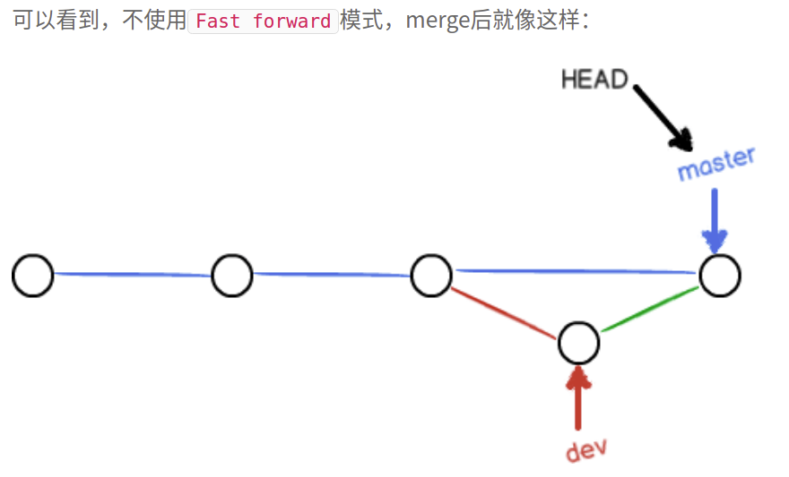

# git 学习笔记

## 创建仓库：

### 步骤

创建一个空目录：

```
$ mkdir learngit   //创建目录
$ cd learngit    //进入文件
$ pwd			//显示当前目录
/Users/michael/learngit
$ git init
Initialized empty Git repository in C:/Users/沈有权/learngit/.git/      //目录变成仓库


```

1. 添加文件：两步

   ```
    $ git add readme.txt		//添加文件：用命令git add告诉Git，把文件添加到仓库，其实就是放到仓库暂存区
   
    $ git commit -m "wrote a readme file"    //用命令git commit告诉Git，把文件提交到仓库的分支master
      [master (root-commit) 1bc1937] wrote a readme file
       1 file changed, 3 insertions(+)
       create mode 100644 readme.txt
   
   
   ```

2. 可多次添加，一次提交；

### 说明

1. 文件放进相应仓库目录才能操作

2. m-"添加相应说明，方便查阅"
3. 文件不能由记事本直接创建，应使用notepad++创建
4. vi readme.txt 查看文档
5. ：wq 退出编辑


## 时光机穿梭

### 版本回退

1. 命令：

   ```
   git diff name   //查找文件修改后差异
   git status      //显示状态
   git log        //显示修改历史（一下就是显示内容）
   				commt后对应是地址
   git  reset --hard HEAD^  //回退上一级，一个^一级  
   git reset --hard commitid   //回退到对应id的修改
                                 怎么查看id？呵呵：
   git reflog     //历史打法，各种修改历史查看id
   { 
   dee81bf (HEAD -> master) HEAD@{0}: reset: moving to dee81b
   6a3a168 HEAD@{1}: reset: moving to HEAD^
   }
   
   
   
   ```

2. 小结：

   - `HEAD`指向的版本就是当前版本，因此，Git允许我们在版本的历史之间穿梭，使用命令`git reset --hard commit_id`。
   - 穿梭前，用`git log`可以查看提交历史，以便确定要回退到哪个版本。
   - 要重返未来，用`git reflog`查看命令历史，以便确定要回到未来的哪个版本。

3. git以跟踪修改来管理

   

   

   

   Git管理的是修改，当用`git add`命令后，在工作区的第一次修改被放入暂存区（stage），准备提交，但是，在工作区的第二次修改并没有放入暂存区，所以，git commit只负责把暂存区的修改提交了，也就是第一次的修改被提交了，第二次的修改不会被提交。

### 撤销修改

- ```
  git restore name(checkout -- name)		//若工作区修改但还没add到暂存区，回退一步修改：
  							            若修改已到暂存区但又进行一步修改，则回退到工作区
  git restore --stage name(reset HEAD name)			//可以把暂存区的修改撤销掉，重新放回工作区：
  git reset --hard id			//已经提交了不合适的修改到版本库时，想要撤销本次提交，
  							不过前提是没有推送到远程库
  							
  ```

### 删除文件

- ```
  rm name						//本地删除文件
  git rm name          		//删除版本库文件文件
  git commit -m"说明"   		//行为说明
  							//如果上面三步都执行了，要复原的话，则
  git restore name			//一键复原到本地文件
  ```

## 远程仓库

### 添加远程仓库

```
$ ssh-keygen -t rsa -C "1019364238@qq.com"       		//用git bush在本地创建ssh key,并手动添加														  id_rsa.pub
$ git remote add origin git@github.com:quanyous/learngit.git   // 把本地仓库关联GitHub仓库。
$ git push -u origin master     //把本地仓库的内容推送到GitHub仓库。
The authenticity of host 'github.com (xx.xx.xx.xx)' can't be established.
RSA key fingerprint is xx.xx.xx.xx.xx.
Are you sure you want to continue connecting (yes/no)?		//当你第一次使用Git的clone或者push命令连接														GitHub时，会得到一个警告因为Git使用SSH连															接，而SSH连接在第一次验证GitHub服务器的Key															时，需要你确认GitHub的Key的指纹信息是否真的														  来自GitHub的服务器，输入yes回车即可。

```
## 分支管理
### 创建分支
- git branch   查看分支
- git branch < name > 创建分支
- git checkout < name >    or   git switch < name > 切换分支
- 创建+切换分支：git checkout -b <name>或者git switch -c <name>
- 合并某分支到当前分支：git merge <name>
- 删除分支：git branch -d <name>

### 解决冲突
当在master和dev上同时做出不同的修改时，合并分支会出错，这时候需要解决冲突。
- git log 查看分支情况
- git log --graph命令可以看到分支合并图

### 分支管理策略
当合并分支时，不想要删除dev分支，可以使用 *--no-ff*模式进行合并。
- 效果图：
这样不会删除dev。

- 类似手机刷机包各种版本！

- git merge --no-ff -m "merge with no-ff" dev #合并分支时，要添加家commit信息。
  

### bug管理
当你接到一个修复一个代号101的bug的任务时，很自然地，你想创建一个分支issue-101来修复它，但是，等等，当前正在dev上进行的工作还没有提交，并不是你不想提交，而是工作只进行到一半，还没法提交，预计完成还需1天时间。但是，必须在两个小时内修复该bug，怎么办？

幸好，Git还提供了一个stash功能，可以把当前工作现场“储藏”起来，等以后恢复现场后继续工作：
这就有点像之前的冲突了。

修复bug时，我们会通过创建新的bug分支进行修复，然后合并，最后删除；

当手头工作没有完成时，先把工作现场git stash一下，然后去修复bug，修复后，再回到dev进行git stash pop，回到工作现场；

在master分支上修复的bug，想要合并到当前dev分支，可以用git cherry-pick < commit >命令，把bug提交的修改“复制”到当前分支，避免重复劳动。 commit 通过 git log查询。


